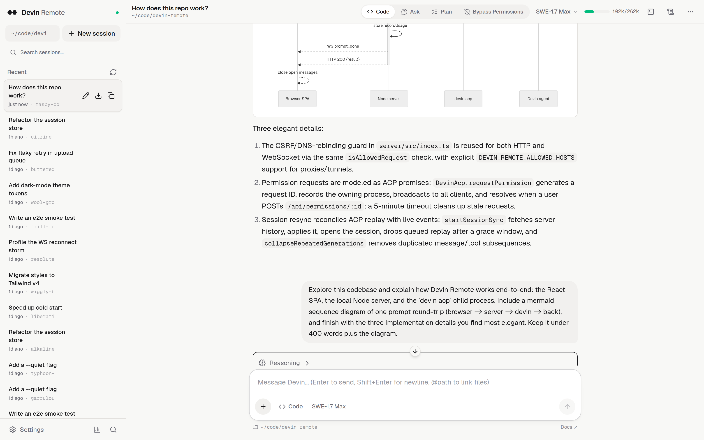
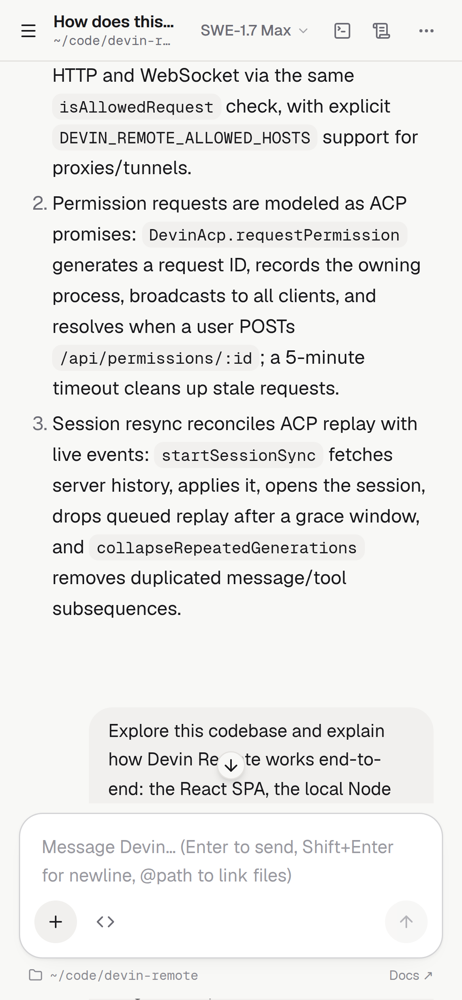
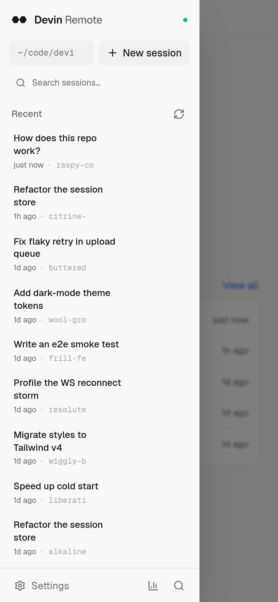
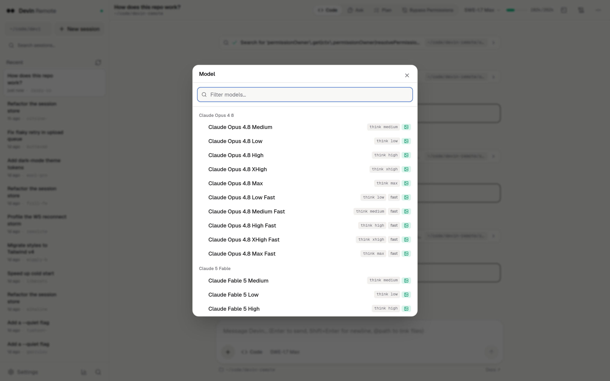
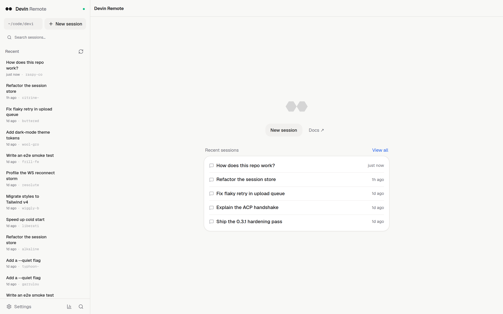
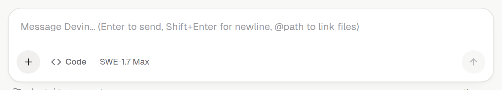
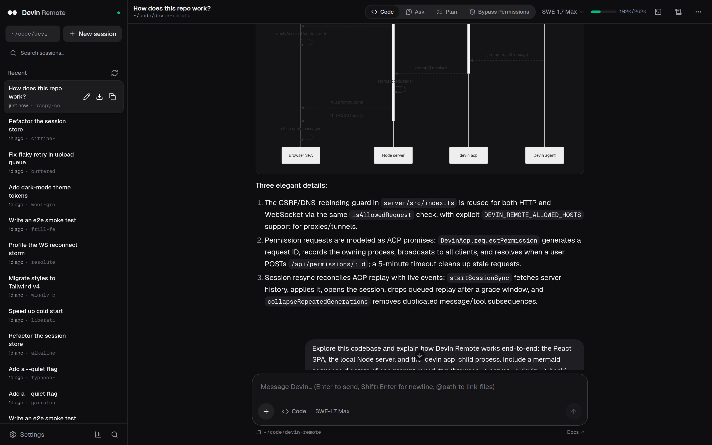

<div align="center">

# Devin Remote

**A browser console for the [Devin CLI](https://docs.devin.ai/cli) — drive your
local Devin sessions from any browser, including your phone.**

Sessions, streaming chat, tool calls, permissions, modes, models, usage stats
and terminals, served locally over the
[Agent Client Protocol](https://agentclientprotocol.com) (ACP).
Think `kimi web`, but for Devin — and open source.

[](https://www.npmjs.com/package/devin-remote)
[](LICENSE)
[](https://nodejs.org)

</div>

```bash
npx devin-remote
```

Then open http://127.0.0.1:7781 — that's it.

<picture>
  <source media="(prefers-color-scheme: dark)" srcset="docs/screenshots/hero-dark.png">
  
</picture>

<table>
  <tr>
    <td width="34%">
      
    </td>
    <td width="34%">
      
    </td>
    <td width="32%" valign="top">
      <br><br>
      <br><br>
      
    </td>
  </tr>
  <tr>
    <td align="center"><sub>On your phone — same server, same sessions</sub></td>
    <td align="center"><sub>Every session, every workspace</sub></td>
    <td align="center"><sub>Model catalog · home · composer</sub></td>
  </tr>
</table>

<details>
<summary><b>Dark mode</b></summary>
<br>

</details>

## Features

- **Session dashboard** — every Devin CLI session across all your workspaces,
  searchable, grouped by directory, with live activity indicators. Resume any
  session with full history replay (`session/load`).
- **Streaming chat** — markdown with GFM, KaTeX math, Mermaid diagrams and
  syntax highlighting; collapsible thinking blocks; plan checklists.
- **Tool calls, rendered properly** — status, per-file diffs with +/- coloring,
  terminal output, locations. Permission requests become inline cards you
  approve or reject from the browser.
- **Devin modes** — Code / Ask / Plan / Bypass, switched live from the header.
- **Model picker** — the full Devin model catalog (~80 options), grouped by
  family with thinking-level (none → max) and speed (fast/priority) variants,
  image-support badges, and Adaptive highlighted.
- **Usage view** — per-session context-window gauge, per-turn token counts,
  daily aggregates, and an approximate cost-tier reference.
- **Terminals** — agent-spawned terminals (ACP `terminal/*`) rendered with
  xterm.js in a bottom drawer.
- **Attachments** — drag & drop or paste images into the composer; `@path`
  mentions send files as context.
- **Session export** — one click downloads a ZIP with the transcript
  (markdown), raw updates (JSONL) and metadata.
- **Command palette** — `Ctrl/Cmd+K` over sessions and Devin slash commands.
- **Settings** — dark/light/system theme, notification sounds, desktop
  notifications, default model & mode for new sessions.
- **Mobile-friendly** — drawer sidebar, bottom composer, touch targets.

## Requirements

- Node.js ≥ 20
- [Devin CLI](https://docs.devin.ai/cli) installed and authenticated:

```bash
devin auth login
```

Devin Remote drives your local `devin` agent — your credentials stay on your
machine, and everything runs against the CLI you already have.

## Usage

```bash
npx devin-remote            # start on :7781 and open the browser
npx devin-remote --port 9000 --no-open
```

| Flag        | Default     | Description                          |
| ----------- | ----------- | ------------------------------------ |
| `--port`    | `7781`      | Port to bind (env `PORT`)            |
| `--host`    | `127.0.0.1` | Host to bind                         |
| `--open` / `--no-open` | auto | Open the browser on start   |
| `--version` |             | Print version                        |

Environment: `PORT`, `DEVIN_REMOTE_HOME` (data dir), and
`DEVIN_REMOTE_ALLOWED_HOSTS` — comma-separated extra hostnames accepted by
the CSRF guard (see [Security](#security)).

Data lives in `~/.devin-remote/` (session aliases, settings, usage history,
uploads). Override with `DEVIN_REMOTE_HOME`.

## Security

The server binds to loopback by default. Only use `--host 0.0.0.0` on networks
you trust (a Tailscale tailnet, a LAN behind your router) — there is no
authentication layer yet; token auth is on the roadmap.

The API and WebSocket are protected by a **CSRF / DNS-rebinding guard**: a
request's `Origin` must match its `Host` (including the port), and `Host`
must be a loopback name, the machine's hostname, an IP literal, or an
explicitly allowed name. This stops arbitrary web pages — including apps on
other ports of the same machine — from driving your Devin.

If you access Devin Remote through a **reverse proxy or tunnel** (nginx,
Caddy, `tailscale serve`, a MagicDNS name), allow its hostname:

```bash
DEVIN_REMOTE_ALLOWED_HOSTS=devin.example.com,machine.tailnet-name.ts.net npx devin-remote
```

Uploads are served with `nosniff` (and a neutering CSP for SVG), the upload
body is capped at 25 MiB, and file access is confined to the workspace.

## How it works

```
browser (React SPA) ──REST/WS──> devin-remote server ──stdio JSON-RPC (ACP)──> devin acp ──> Devin
```

Devin Remote spawns one `devin acp` process per workspace directory and speaks
the [Agent Client Protocol](https://agentclientprotocol.com) over stdio — the
same protocol Zed uses to embed coding agents. Session updates stream to the
browser over a WebSocket; your actions (prompts, permission decisions, mode and
model changes) go back over REST. No database, no native modules, no cloud
relay.

## Development

```bash
git clone https://github.com/zouhall/devin-remote.git
cd devin-remote
npm install
npm run dev        # server on :7781 (tsx watch) + web on :5173 (vite)
```

```bash
npm run build      # web → dist/web, server → dist/server
npm start          # production server serving dist/web
npm run typecheck  # tsc, both projects
npm run smoke      # end-to-end ACP smoke test against your devin CLI
```

Stack: Node + TypeScript server (`@agentclientprotocol/sdk`, `ws`, `fflate`),
React + Vite frontend ([assistant-ui](https://www.assistant-ui.com/), Tailwind
v4, KaTeX, Mermaid, xterm.js).

## Roadmap

- Token authentication for `--host` exposure
- Interactive terminal input
- Devin Cloud (remote) sessions
- Windows support (today: macOS, Linux, WSL)

## Disclaimer

Devin Remote is a community project and is **not affiliated with or endorsed
by Cognition AI**. "Devin" is a trademark of Cognition AI. Requires a valid
Devin account.

## License

[MIT](LICENSE)
